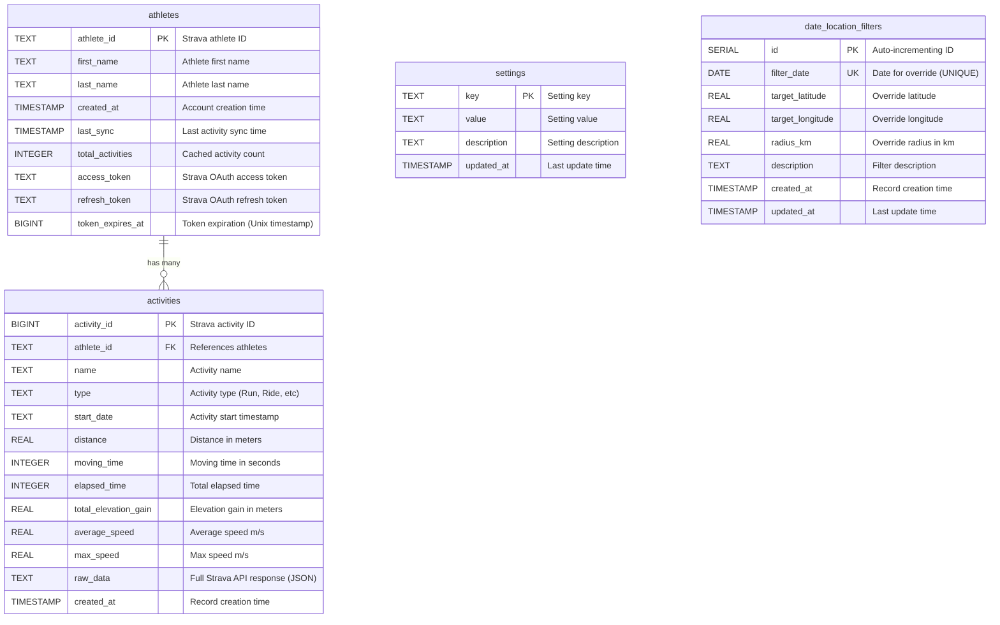

# Database Schema

## Entity Relationship Diagram



## Table Descriptions

### athletes
**Purpose:** Stores athlete profiles and OAuth tokens for API access.

**Key Features:**
- Primary authentication and identity table
- Stores Strava OAuth tokens in database (moved from file storage)
- Tracks sync status and activity count
- One athlete can have many activities

**Indexes:**
- Primary Key on `athlete_id`

---

### activities
**Purpose:** Stores individual Strava activities with full API data.

**Key Features:**
- Linked to athletes via foreign key
- Structured columns for common queries
- `raw_data` JSON column preserves complete Strava response
- Used for GPS-based location filtering

**Indexes:**
- Primary Key on `activity_id`
- `idx_athlete_activities` on `(athlete_id, start_date)` - for user queries
- `idx_activity_date` on `start_date` - for date-based filtering

**Relationships:**
- Many-to-One with `athletes` table

---

### settings
**Purpose:** Application-wide configuration values.

**Key Features:**
- Key-value storage for app settings
- Default location coordinates (latitude, longitude)
- Default filter radius
- Standalone table (no relationships)

**Default Values:**
- `target_latitude`: 50.097416 (Prague)
- `target_longitude`: 14.462274
- `filter_radius_km`: 1.0

---

### date_location_filters
**Purpose:** Date-specific location overrides for activity filtering.

**Key Features:**
- Allows different GPS filters for specific dates
- Overrides default location settings from `settings` table
- Useful for events at different locations
- Standalone table (no relationships)

**Indexes:**
- Primary Key on `id` (auto-increment)
- Unique constraint on `filter_date`
- `idx_date_filters_date` on `filter_date` - for date lookups

---

## Relationships

### One-to-Many: athletes → activities
- Each athlete can have multiple activities
- Foreign key: `activities.athlete_id` → `athletes.athlete_id`
- Cascade behavior: Not defined (manual cleanup required)

### No Direct Relationships
- `settings` and `date_location_filters` are standalone configuration tables
- Referenced programmatically but no database-level foreign keys

---

## Data Flow

1. **Authentication Flow:**
   ```
   Strava OAuth → athletes table (saves tokens)
   ```

2. **Activity Sync Flow:**
   ```
   Strava API → activities table → linked to athletes
   Token refresh → updates athletes.access_token & refresh_token
   ```

3. **Location Filtering:**
   ```
   Activity date → check date_location_filters
   If no date filter → use settings table defaults
   Apply GPS filtering → activity.raw_data (start_latlng, end_latlng)
   ```

---

## Database Type

**PostgreSQL** (version 16 recommended)

- No SQLite fallback
- Uses PostgreSQL-specific features:
  - `SERIAL` for auto-increment
  - JSON operators (`->>`, `->`)
  - `DO $$` blocks for migrations
  - `ON CONFLICT` for upserts

---

## Migration Strategy

Token columns added in recent update:
- `ALTER TABLE` statements added to `init_data_tables()`
- Checks for column existence before adding
- Graceful migration for existing databases
- No data loss on upgrade
